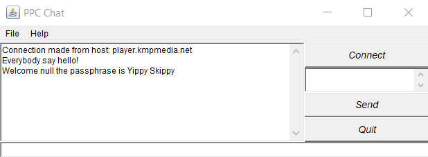
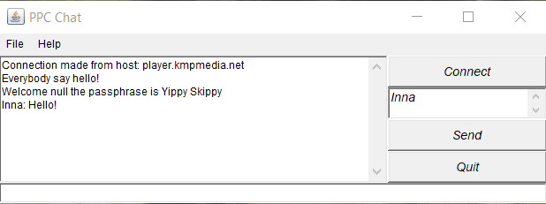
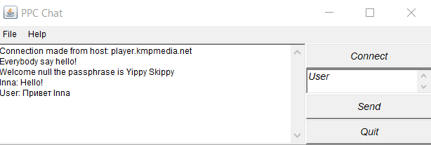
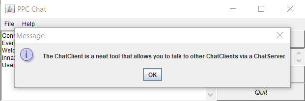

# Створення сокет-клієнта
## Завдання ("на п'ять")
1. позбавтесь від використання **файлу хостів** в коді сервера (розберіться як він працює та змініть так аби позбавитись помилок при його запуску)
2. реалізуйте підтримку кирилиці - кодування **UTF-8** (потрібну для цього інформацію ви знайдете [тут](http://tutorials.jenkov.com/java-io/inputstreamreader.html))
### Результат

